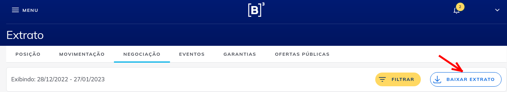
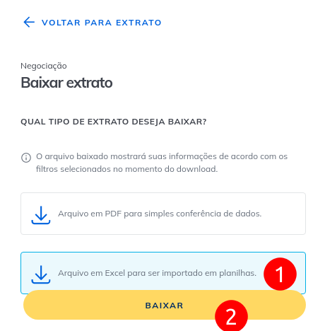

# 📊 IR Calculator — Calculadora de Imposto de Renda sobre Ações

Calcula automaticamente o **preço médio de compra**, **lucro/prejuízo por venda** e gera um relatório Excel separado por ano para auxiliar na declaração do Imposto de Renda.

---

## 🚀 Como usar

### 1. Instalar dependências

```bash
pip install pandas openpyxl
```

### 2. Exportar suas negociações da B3

Acesse [investidor.b3.com.br/extrato/negociacao](https://www.investidor.b3.com.br/extrato/negociacao), selecione o período desejado e exporte o arquivo Excel.

**Tela de negociações:**



**Modal de exportação:**



Salve o arquivo exportado com o nome `nacional.xlsx` na mesma pasta do script.

> 💡 Para ativos internacionais, exporte o extrato da sua corretora e salve como `internacional.xlsx`. Veja o formato esperado abaixo.

---

### 3. Configurar o script

Abra `seven-biz-calculate.py` e ajuste as duas primeiras variáveis:

```python
ARQUIVO_NACIONAL      = "nacional.xlsx"       # xlsx exportado do B3
ARQUIVO_INTERNACIONAL = "internacional.xlsx"  # xlsx da corretora (ou None)
```

Se não tiver ativos internacionais, coloque `None`:

```python
ARQUIVO_INTERNACIONAL = None
```

### 4. Executar

```bash
python3 seven-biz-calculate.py
```

O script vai gerar o arquivo `resultado_ir.xlsx` com as seguintes abas:

| Aba | Conteúdo |
|-----|----------|
| **Carteira Atual** | Posição atual de todos os ativos (qtd, custo total, preço médio) |
| **Vendas XXXX** | Detalhamento de cada venda do ano: preço médio de compra, preço de venda, lucro/prejuízo |
| **Resumo XXXX** | Posição em 31/12 do ano + resultado das vendas — **use isso para declarar o IR** |
| **Todas as Vendas** | Histórico completo de todas as vendas |

---

## 📁 Formato dos arquivos

### Arquivo Nacional (B3)

Exportado diretamente do site [Investidor B3](https://www.investidor.b3.com.br/extrato/negociacao). O script lê automaticamente as colunas:

| Data do Negócio | Tipo de Movimentação | Código de Negociação | Quantidade | Preço | Valor |
|---|---|---|---|---|---|
| 10/03/2026 | Compra | BBSE3F | 3 | 34.32 | 102.96 |

> O sufixo `F` de mercado fracionário (ex: `VIVT3F` → `VIVT3`) é removido automaticamente.

### Arquivo Internacional

Exportado pela corretora (Inter, Apex, etc.) em formato Excel com as colunas:

| Data operação | Categoria | Código Ativo | Operação C/V | Quantidade | Preço unitário |
|---|---|---|---|---|---|
| 12/09/2025 | Stocks | INTR | V | 1,65907180 | 9,04 |

---

## ⚠️ Observações importantes

- **O preço médio é cumulativo entre anos**: se você comprou um ativo em 2022 e vendeu em 2024, o preço médio leva em conta todas as compras anteriores.
- **Cada ano é independente para fins de IR**: lucros e prejuízos de um ano não se compensam com os de outro.
- Os arquivos `nacional.xlsx`, `internacional.xlsx` e `resultado_ir.xlsx` estão no `.gitignore` para proteger seus dados financeiros.
